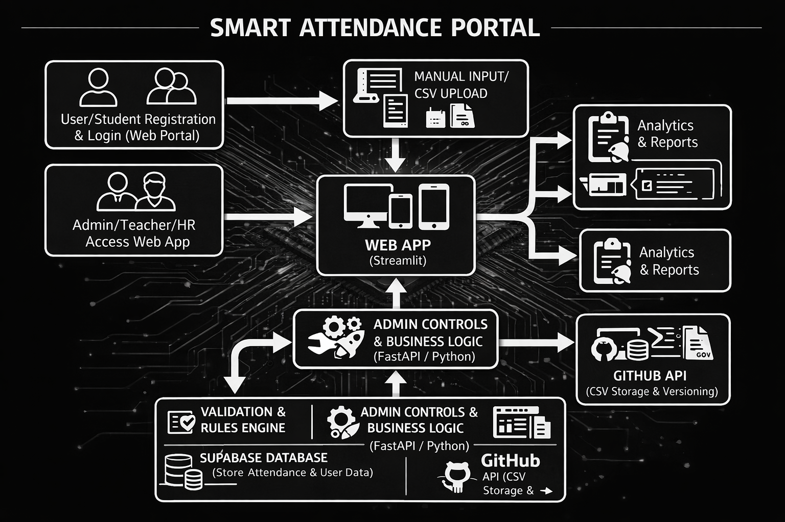
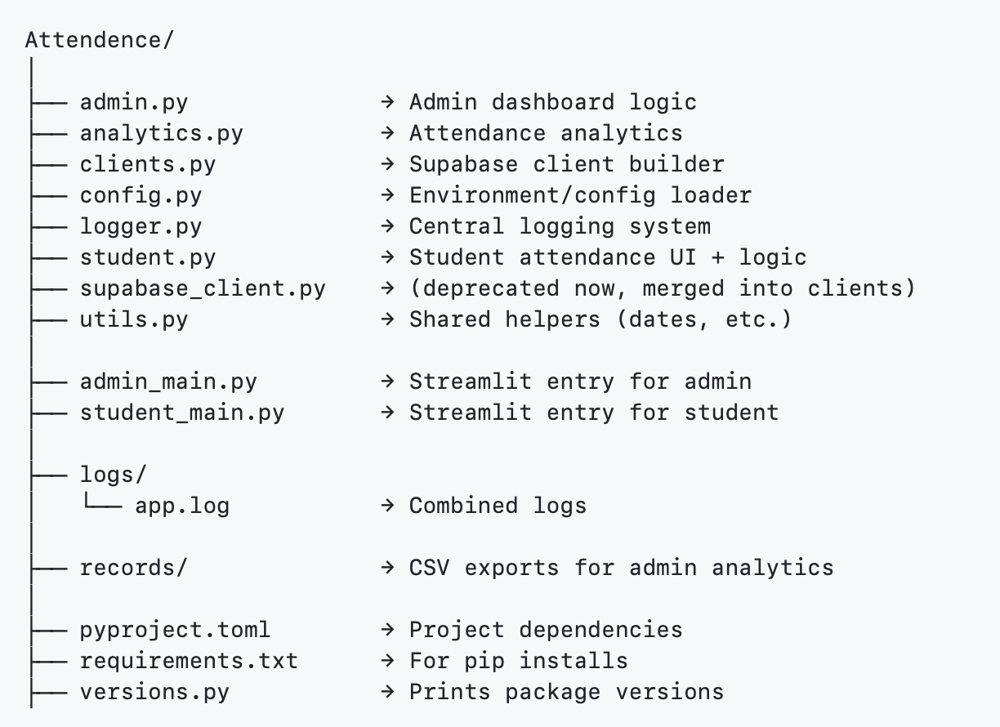

## 🧠 Smart Attendance System

A modular, scalable, and secure web-based attendance tracking system built using **Streamlit**, **Supabase**, and **Python**.  
Designed with a role-based architecture, it provides separate interfaces for **Admins** and **Students** with real-time validation and analytics.


---

## SYSTEM ARCHITECTURE 



---


## Project Setup (Using uv)

```bash
uv init
uv venv venv
```

### ▶ Activate Environment

**Mac/Linux:**
```bash
source venv/bin/activate
```

### Install Dependencies

```bash
pip install -r requirements.txt
``` 

## PROJECT STRUCTURE




---

## 🔐 Admin Panel

> 🔓 Accessible only with valid admin credentials

### 📚 Class Management

* ➕ **Create Class** with default code and daily attendance limit
* 📂 **Select and Manage Classes**
* ⚙️ **Update Attendance Code & Daily Limit**
* 🔃 **Toggle Attendance Status** (Open/Close)
* 🚫 Only **one class** can be open for attendance at a time

### 📈 Attendance Matrix

* 📊 View attendance in a **date-wise pivot table**
* ✅ "P" entries marked in green | ❌ "A" entries marked in red
* ⬇️ **Download matrix as CSV**
* 🚀 **Push CSV to GitHub repository** (auto-commits with timestamped filenames)

### 🗑️ Delete Class

* Permanently deletes:

  * Class settings
  * Attendance records
  * Roll-number mappings
* ❗ Requires `"DELETE"` confirmation to proceed

---

## 🎓 Student Panel

> 🧑‍🎓 No login required — attendance can only be marked when a class is **open**

### 📝 Submit Attendance

* 🔍 **Select open class**
* 🧾 **Enter Roll Number & Name**

  * Name gets **locked to roll number** after first submission
* 🔐 **Enter Valid Attendance Code**
* ❌ Blocked if:

  * Wrong code is entered
  * Student already marked attendance for the day
  * Class has reached its daily attendance limit

### 📋 View Personal Attendance

* 🧑‍💼 **Displays only student's own records**
* 📅 Shows attendance across all dates in a structured table
* ✅ Filtered view ensures data privacy and focus

---

## ⚙️ Tech Stack

| Layer         | Technology       |
| ------------- | ---------------- |
| Frontend      | Streamlit        |
| Database      | Supabase         |
| Backend Logic | Python + Pandas  |
| Storage       | GitHub API (CSV) |
| Visualization | Matplotlib       |

---

## ✅ Highlights

* Clean and role-based user interface
* GitHub-integrated data export for version tracking
* Real-time data validation and status checks
* Modular structure for easy extension and maintenance

## ❤️ Credits

Created as a complete end-to-end Smart Attendance System using **Python, Streamlit, Supabase, Pandas, Matplotlib, GitHub API**.

Designed with a focus on **modularity, real-time validation, role-based access, and scalable architecture**.